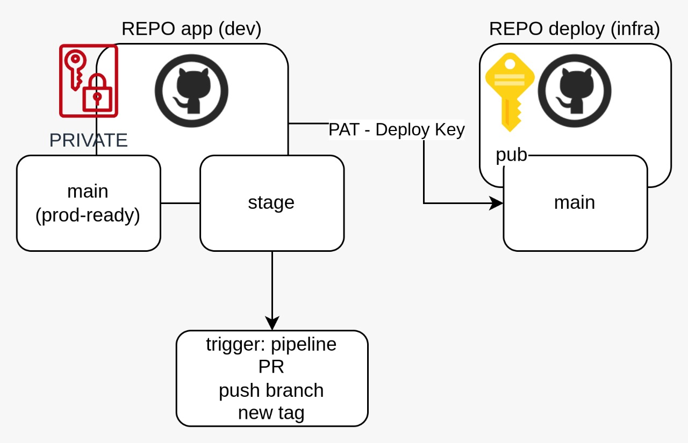

# 01 Github & App setup <!-- omit in toc -->
Control de versiones para los proyectos.

Se requieren dos repositorios:

- Para el código de las aplicaciones (Dev)
- Para los YAML's de Kubernetes (Ops)




# 1. Crear cuenta GITHub
Esta cuenta se utilizará para el control de versiones de la aplicación (Dev)
## 1.1. Crear llave ssh
```vim
ssh-keygen -q -N "" -C "user@lab.com"
cat ~/.ssh/id_rsa.pub
```
## 1.2. Agregar la llave PÚBLICA a la cuenta Github
- Cuenta - Settings - SSH and GPG Keys

## 1.3. Crear repositorio privado con el nombre: Dev
## 1.4. Agregar el repositorio al entorno local
```vim
cd ~
mkdir dev
cd dev

echo "# dev" >> README.md
git init
git add README.md
git commit -m "first commit"
git branch -M main
git remote add origin <SSH LINK>
git push -u origin main
```

## 1.5. Git branch
El repositorio de aplicación requiere dos Branches: Stage y Main (Producción)

- stage
- main= production

```vim
git checkout -b stage
git push -u origin stage
```

# 2. Agregar la App CICDlabs (public-api) y subir el código a GitHub
## 2.1. copy cicd/dev/public-api folder
```vim
 cp -r ../cicdlabs/assets/dev/public-api/. .
```

## 2.2. Sincronizar el proyecto con Github - branch: stage
```vim
git add .
git commit -m 'starting code'
git push origin stage
```

# 4. DockerHub
## 4.1. Create Account
> [Docker Hub](https://hub.docker.com/)
## 4.2. Login
> [login](https://docs.docker.com/engine/reference/commandline/login/)
```vim
sudo apt update
curl -fsSL https://get.docker.com -o get-docker.sh
sudo sh get-docker.sh

sudo usermod -aG docker $USER
newgrp docker

docker login
```

# 5. Construir el contenedor Docker
```vim
source .env.qa
echo $APP_ENV_KUBE_API
export REGISTRY=<DOCKER REGISTRY>

docker build . -t $REGISTRY/kubelabs_publicapi:1.0.0 --build-arg APP_ENV="$APP_ENV_KUBE_API"

docker images

docker push $REGISTRY/kubelabs_publicapi:1.0.0

# test
docker run -d --restart always --name api -p 3080:3080 $REGISTRY/kubelabs_publicapi:1.0.0
docker ps

curl localhost:3080/healthcheck
curl localhost:3080/crash

# check status (UP 2 seconds)
docker ps

# random crash: 0 = process.exit(1)
curl localhost:3080/random_crash

docker rm -f api

docker ps -a
```

# 6. Convertir el DOCKER repo en privado
