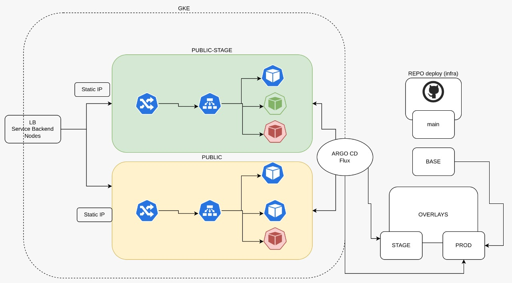

# 02 Install Kubernetes Cluster <!-- omit in toc -->



# 1. Kind
```
[ $(uname -m) = x86_64 ] && curl -Lo ./kind https://kind.sigs.k8s.io/dl/v0.20.0/kind-linux-amd64
chmod +x ./kind
sudo mv ./kind /usr/local/bin/kind

kind version
```

```
sudo snap install kubectl --classic
```

## 1.1. Instalar cluster
# 2. Crear Cluster
## 2.1. Crear el archivo kind-cluster.yaml
```yaml
apiVersion: kind.x-k8s.io/v1alpha4
kind: Cluster
name: demo
nodes:
  - role: control-plane
    kubeadmConfigPatches:
      - |
        kind: InitConfiguration
        nodeRegistration:
          kubeletExtraArgs:
            node-labels: "ingress-ready=true"
    extraPortMappings:
      - containerPort: 80
        hostPort: 80
        protocol: TCP
      - containerPort: 30080
        hostPort: 30080
        protocol: TCP
  - role: worker
  - role: worker
  - role: worker

```
## 2.2. Crear el cluster
```
kind create cluster --config kind-cluster.yaml

kubectl cluster-info --context kind-demo

kubectl get nodes
```
Resultado:
```
Kubernetes control plane is running at https://127.0.0.1:41513
CoreDNS is running at https://127.0.0.1:41513/api/v1/namespaces/kube-system/services/kube-dns:dns/proxy
```


# Instalar Ingress Controller
```
kubectl apply -f https://raw.githubusercontent.com/kubernetes/ingress-nginx/main/deploy/static/provider/kind/deploy.yaml

kubectl wait --namespace ingress-nginx \
  --for=condition=ready pod \
  --selector=app.kubernetes.io/component=controller \
  --timeout=90s
```


# 3. Otras opciones
## 3.1. MicroK8s
## 3.2. Minikube
## 3.3. [GKE](./GKE.md)
## 3.4. [EKS](./EKS.md)
