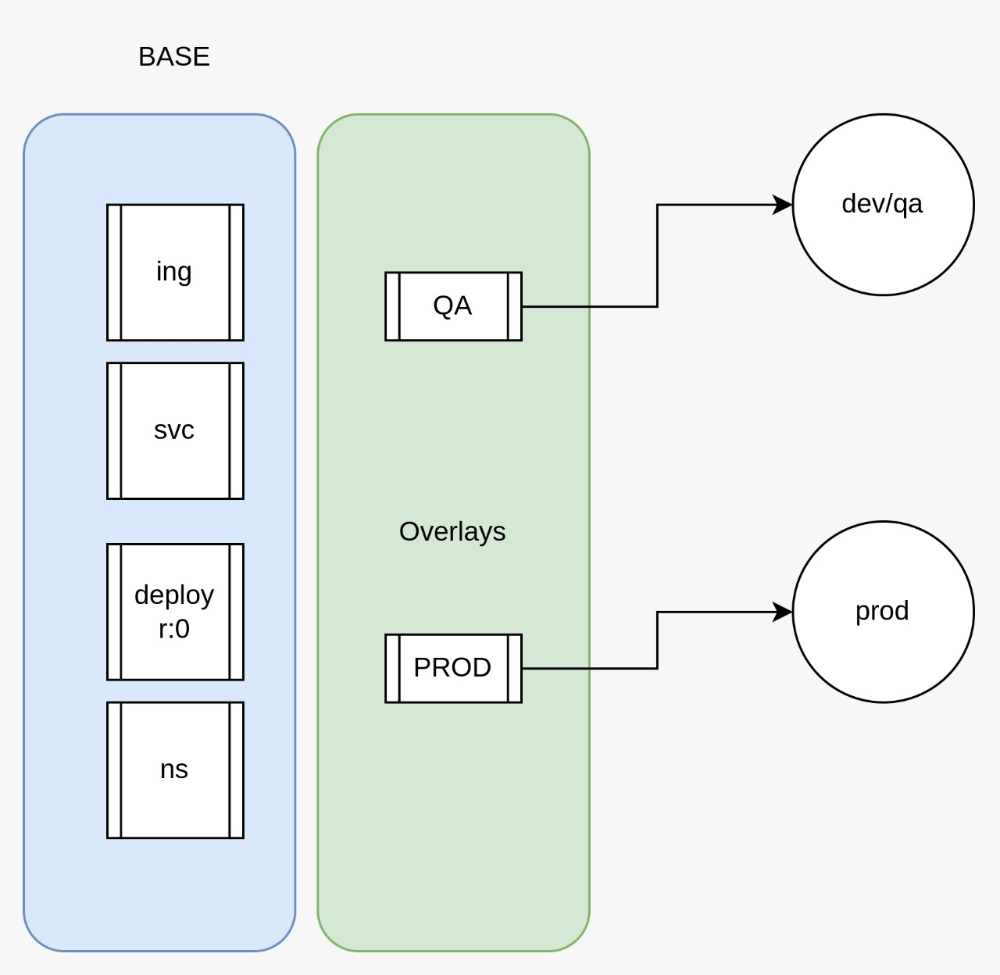

# 04 kustomize <!-- omit in toc -->
> [kustomize](https://kustomize.io/)

Kustomize automatiza la creación de recursos Kubernetes en diferentes ambientes.
Se define una configuración base con los archivos Yaml necesarios
Los ambientes se dividen en Overlays.



# 1. Delete public ns
```vim
kubectl delete ns public-stage --force --grace-period=0

# forzar el "finalizer"
export NS=public-stage &&
kubectl get namespace "${NS}" -o json \
  | tr -d "\n" | sed "s/\"finalizers\": \[[^]]\+\]/\"finalizers\": []/" \
  | kubectl replace --raw /api/v1/namespaces/${NS}/finalize -f -
```

# 2. Install Kustomize
```vim
sudo snap install kustomize

kustomize version
```
# 3. GitHub OPS Project folder structure
public-api/
- base
- overlays
- - stage
- - production

# 4. Crear los archivos Kustomize BASE + STAGE
> [app kustomize](./assets/kustomize/)

## 4.1. BASE - kustomization.yaml
```yaml
apiVersion: kustomize.config.k8s.io/v1beta1
kind: Kustomization

resources:
  - cm.yaml
```
## 4.2. BASE - cm.yaml
```yaml
apiVersion: v1
kind: ConfigMap
metadata:
  name: cm-private-api
  # namespace: public  >>>   SE ELIMINA !!
data:
  # SE CREA UNA "VARIABLE PARA REMPLAZARLA EN EL AMBIENTE CORRECTO"
  PRIVATE_API: PRIVATE_API_URL
```
## 4.3. STAGE - ns.yaml
```yaml
apiVersion: v1
kind: Namespace
metadata:
  name: public-stage
```
## 4.4. PRODUCTION - ns.yaml
```yaml
apiVersion: v1
kind: Namespace
metadata:
  name: public  # PRODUCTION !!!
```
## 4.5. STAGE - kustomization.yaml
```yaml
apiVersion: kustomize.config.k8s.io/v1beta1
kind: Kustomization

namespace: public-stage

# deprecated
commonLabels:
  app: public-api
  team: devops

# labels:
# - pairs:
#     app: public-api
#     team: devops
#   includeSelectors: true

commonAnnotations:
  note: "Este es el ambiente de STAGE"

resources:
- ns.yaml
- ../../base

patches:
- target:
    kind: ConfigMap
    name: cm-private-api
  path: cm-patch.yaml
```
## 4.6. STAGE - cm-patch.yaml
```yaml
- op: replace
  path: /data/PRIVATE_API
  value: STAGE_ENDPOINT # <- valor de ejemplo para ambiente staging
```
## 4.7. Construir los recursos usando Kustomize para el ambiente STAGE:
```
kustomize build overlays/stage
```

## 4.8. BASE - deploy - ingress - service - secret
```yaml
apiVersion: kustomize.config.k8s.io/v1beta1
kind: Kustomization

resources:
  - cm.yaml
  - secret.yaml
  - svc.yaml
  - ing.yaml
  - deploy.yaml
```
- Crear los archivos yaml del BASE con siguiente contenido:
> [BASE completo](./assets/kustomize/public-api/base/)

### 4.8.1. crear el secret.yaml
```
export DOCKER_PATH=/home/kube/.docker/config.json

kubectl create secret generic regcred \
    --from-file=.dockerconfigjson=$DOCKER_PATH \
    --type=kubernetes.io/dockerconfigjson \
    -n public-stage --dry-run=client -o yaml
```

## 4.9. Completar el STAGE kustomization.yaml con el siguiente contenido:
> [kustomization](./assets/kustomize/public-api/overlays/stage/kustomization.yaml)

# 5. Eliminar el deployment existente.

# 6. Build
Construye los recursos Kubernetes de acuerdo al ambiente:
Este comando genera un archivo yaml para verificar la configuración
```vim
kustomize build overlays/stage > build-stage.yaml
```
# 7. Apply
Aplica la configuración Kustomize en el Cluster.
```vim
kubectl apply -k overlays/stage
```

# 8. Check
```vim
curl  http://api-stage.<DOMAIN>/random_crash
```


