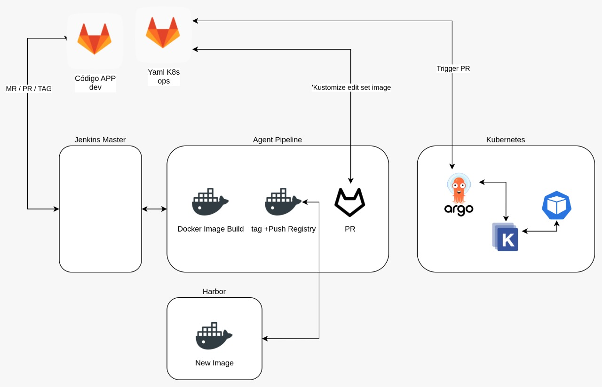

# 08 Github Actions <!-- omit in toc -->
> [syntax](https://docs.github.com/en/actions/using-workflows/workflow-syntax-for-github-actions)



# 1. CI: Stage branch: workflow file
> .github/workflows

> hello.yaml

```vim
git checkout stage
```

```yaml
name: hello-world
# trigger
on:
  push:
    branches: ["stage"]
# pipeline
jobs:
  print: # job name
  # ejecuta el pipeline en una VM Ubuntu
    runs-on: ubuntu-latest

    # Pasos a ejecutar
    steps:
      - name: print-to-screen
        run: echo "Hello World!"
```

> Runners: https://docs.github.com/en/actions/using-github-hosted-runners/about-github-hosted-runners

## 1.1. git push and check actions tab
```git
git add .
git commit -m "new demo action"
git push
```
## 1.2. set Arguments
```yaml
on:
...
env:
  TEXT: "mi nombre completo"
...
 run: echo "Hello World ${{ env.TEXT }}!"
```

## 1.3. Secrets
> Settings - Secrets - Actions

> Add SECRET_NAME key-value

## 1.4. set Arguments
```yaml
on:
...
	- name: print-secret
	run: echo "Secret value ${{ secrets.SECRET_NAME }}"
```
## 1.5. Expressions
>[expressions](https://docs.github.com/en/actions/learn-github-actions/expressions)

```yaml
      - name: The job has succeded?
        if: ${{ success() }}
        run: echo "Job Succeded!!!"


      - name: The job has failed?
        if: ${{ failure() }}
        run: echo "Job Fails :("
```

> "Job has failed" has not been executed

### 1.5.1. Force job to fail
```yaml
        if: ${{ success() }}
        run: return 1
```

# 2. Check Actions tab: docker image

# 3. Build Docker image with args
- filename: stage.yaml
- Branch stage
- env var for REGISTRY & IMAGE NAME
```yaml
name: STAGE

on:
  push:
    branches: [ "stage" ]

env:
  REGISTRY: cachac
  IMAGE_NAME: kubelabs_publicapi
  OPS_REPO: Storylabs-Learning/ops
  OPS_BRANCH: main

jobs:

  build:

    runs-on: ubuntu-latest

    steps:
```

## 3.1. Check out Github application code
```yaml
      - uses: actions/checkout@v3 # checkout github code
        name: Checkout code
        with:
          fetch-depth: 0 # fetch tags
```

## 3.2. Login to Registry (Docker Hub)
- Add Secrets: DOCKER_USERNAME & DOCKER_PASSWORD
```yaml
    - name: Login to DockerHub
      uses: docker/login-action@v2
      with:
        username: ${{ secrets.DOCKER_USERNAME }}
        password: ${{ secrets.DOCKER_PASSWORD }}
```

## 3.3. Docker Container Build & Push (Image  Tag: latest version)
> [Docker Buildx](https://github.com/docker/build-push-action)

- Add secret: APP_ENV
```vim
{ "APP_NAME":"backend", "NODE_ENV":"stage", "NODE_PORT":"3000", "TOKEN_LIMIT":"7d", "TOKEN_SECRET":"PASS" }
```

```yaml
    - name: Build & Push
      uses: docker/build-push-action@v3
      with:
        push: true
        # file: ./path-to-dockerfile
        tags: ${{ env.REGISTRY }}/${{ env.IMAGE_NAME }}:latest
        build-args: |
          APP_ENV=${{ secrets.APP_ENV }}
```
## 3.4. Optional: Docker run (testing container)
```yaml
    - name: Run test
      run: docker run --rm --name api -p 3000:3000 ${{ env.REGISTRY }}/${{ env.IMAGE_NAME }}:latest
```

# 4. Check Docker Hub container latest version

# 5. Add tag version
```yaml
...
      - name: Get TAG version
        run: echo "RELEASE_VERSION=$(git tag --sort=-creatordate | head -1)" >> $GITHUB_ENV

      - name: Show Tag Version
        run: echo ${{ env.RELEASE_VERSION }}
...
```

## 5.1. add RELEASE_VERSION to docker build command
```yaml
tags: ${{ env.REGISTRY }}/${{ env.IMAGE_NAME }}:${{ env.RELEASE_VERSION }}
```

## 5.2. New git tag and push to stage branch
```vim
git tag -m "docker tag version" -a 1.0.1

git add .
git commit -m "git hub workflow - tag version"
git push origin stage  --tags

# If only push a specific tag:
# git push origin stage 1.0.1
```
## 5.3. Docker Hub: Check new tag


# 6. CD: Deploy to Kubernetes
## 6.1. output version from Build Job
Update Step "New Tag Version"
```yaml
      - name: New Tag Version
        id: tagVersion
        run: |
          echo ${{ env.RELEASE_VERSION }}

          # Crea una variable tipo output para ser utilizada en otro JOB
          echo "RELEASE_VERSION=${{ env.RELEASE_VERSION }}" >> $GITHUB_OUTPUT
```
Set an build Job Output
```yaml
  build:
    runs-on: ubuntu-latest

    # exporta las variables tipo output al resto de JOBS del pipeline
    outputs:
      RELEASE_VERSION: ${{ steps.tagVersion.outputs.RELEASE_VERSION }}
```

## 6.2. Create deploy key (OPS repo)
Es necesaria una llave de acceso para la cuenta de OPS
> Repo Settings - Deploy keys (Write access)

> Public ssh key

### 6.2.1. Optional: Create a PAT from Git Deploy Repo
> User Profile - Settings - Developer Settings - Personal Access Token

> Repo permissions

## 6.3. Add new Secret in DEV Repo

> OPS_TOKEN = ssh-private key or PAT

## 6.4. New Job: deploy
Descarga el código del repo OPS en el pipeline para hacer el cambio de versión de la imagen de Kubernetes.

```yaml
  deploy:
    name: Deploy
    runs-on: ubuntu-latest
    needs: build

    env:
      VERSION: ${{ needs.build.outputs.RELEASE_VERSION }}

    steps:
      - name: Checkout OPS code
        uses: actions/checkout@v3
        with:
          repository: ${{ env.OPS_REPO }}
          # token: ${{ secrets.OPS_TOKEN }}
          ssh-key: ${{ secrets.OPS_TOKEN }}
```

## 6.5. set up kustomize
>[market-place](https://github.com/marketplace/actions/setup-kustomize)
```yaml
 - name: Setup Kustomize
   uses: imranismail/setup-kustomize@v2
   with:
     kustomize-version: "3.6.1"
```

## 6.6. set up new image version
```yaml
      - name: Update Kubernetes resources
        run: |
          cd public-api/overlays/stage

          kustomize edit set image KUSTOMIZE-DEFINED=${{ secrets.DOCKER_USERNAME }}/${{ env.IMAGE_NAME }}:${{ env.VERSION }}

          kustomize build . > kustomized-apps.yml
          cat kustomized-apps.yml
```

## 6.7. commit changes to git OPS repo
```yaml
      - name: Commit files
        run: |
          git config --local user.email "deploy-bot@stotylabs.dev"
          git config --local user.name "Storylabs deploy-Bot"
          git add .
          git commit -am "New image version, branch: staging, tag: ${{ env.VERSION }}"
          git push --force origin ${{ env.OPS_BRANCH }}
```

# 7. Commit action workflow
# 8. Check git OPS repo (UI)
# 9. Check Argo Changes
# 10. Check pods
```
kubectl describe pods -n public-stage | grep Image:
```
# 13. Change application package.json version
## 13.1. version 2.0.0
## 13.2. new tag 2.0.0
```
git tag -m "new fixes" -a 2.0.0

git add .
git commit -m "new fixes"
git push origin stage  --tags
```
## 13.3. commit and push changes

# 11. Optional: Avoid "Nothing to commit error"
in step: Commit files
```yaml
git diff-index --quiet HEAD || git commit -am "New image version. Branch staging. tag: ${{ env.VERSION }}"
```
# 12. Optional: get commit hash
(instead of git tag)
```yaml
run: echo "RELEASE_VERSION=$(git rev-parse --short HEAD)" >> $GITHUB_ENV
```


