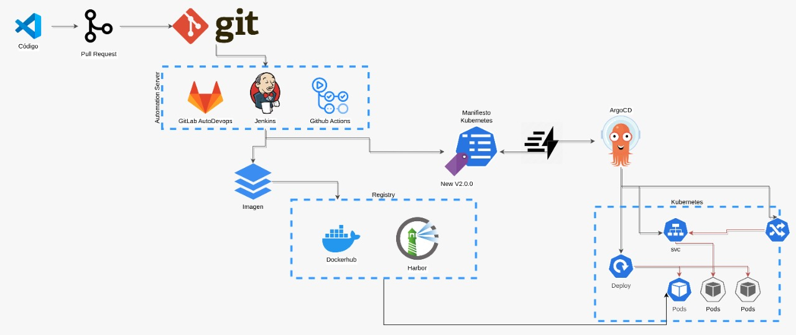

# 1. GitOPS + CI/CD labs <!-- omit in toc -->
github actions + kubernetes + ArgoCD

## 1. [Github Dev Repo + Dockerhub](./01.Github.md)
## 2. [Kubernetes Cluster](./02.KubernetesCluster.md)
## 3. [OPS definition Files](./03.Ops.md)
## 4. [Kustomize](./04.Kustomize.md)
## 5. [Practice](./05.Kustomize%20Practice.md)
## 6. [GitOPS](./06.ArgoCD.md)
## 7. [Practice](./07.ArgoCD%20Practice.md)
## 8. [Github Actions](./08.Actions.md)
## 9. [Practice](./09.Actions%20Practice.md)
## 10. [Full lab](./10.Fulllab.md)
## 11. Porfolio

